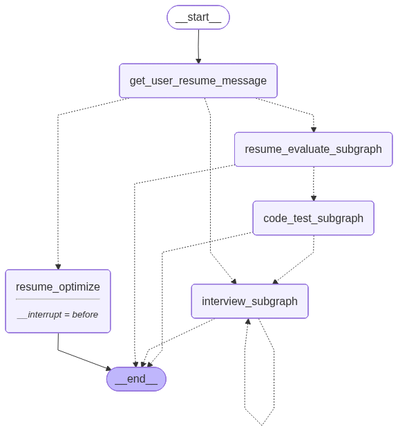
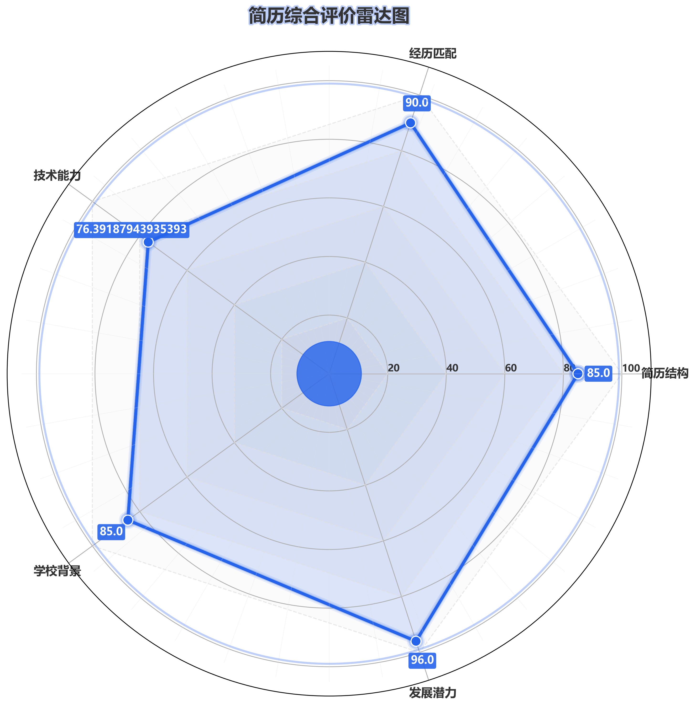
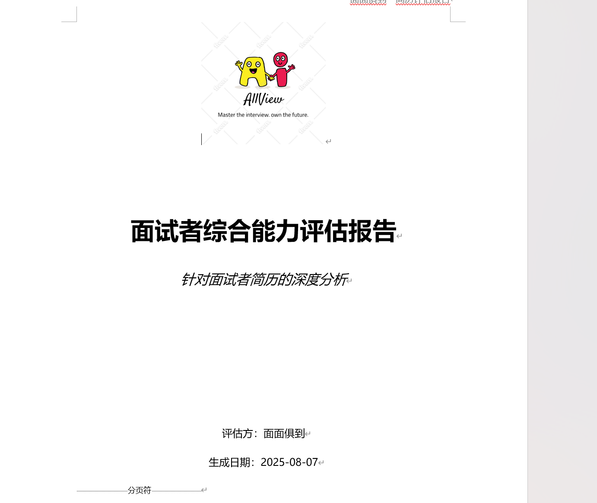
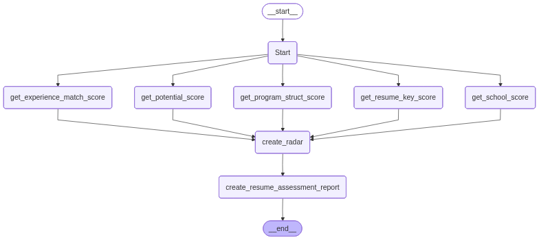
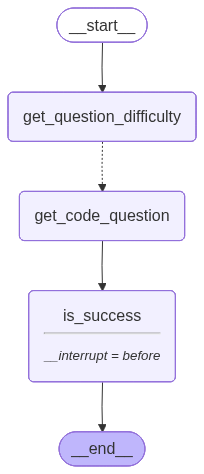
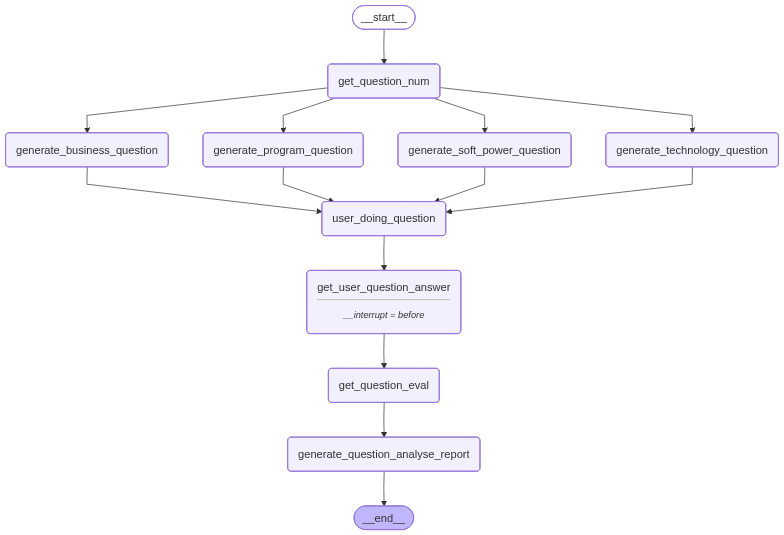

# 大模型辅助面试平台

[](LICENSE)
[](https://www.python.org/)
[](https://github.com/langchain-ai/langgraph)

## 项目简介

大模型辅助面试平台是一个基于大语言模型和多智能体技术构建的综合性招聘与面试辅助系统。该平台旨在通过自动化和智能化的方式，全面提升求职者的面试表现和成功率。

本系统采用先进的LangGraph和LlamaIndex框架，结合多模态分析技术，为用户提供从简历评估优化、算法测试到模拟面试的全链路面试准备服务。项目同时整合了中国软件杯iFLYTEK A3竞赛的技术要求，实现了企业级的面试评估解决方案。

## 系统架构说明

### 分层主从架构 (Hierarchical Architecture)

本系统采用了先进的分层主从架构设计，相比传统的扁平化架构具有以下优势：

- **主智能体连接子图**：主智能体不再直接连接单层从节点，而是连接完整的子图（subgraph），实现更复杂的任务流控制
- **子图协同工作**：通过主子图协同使系统更易扩展，任务流更灵活、并行度更高
- **模块化设计**：各功能模块以子图形式独立运行，便于维护和扩展

### LangGraph 回调机制

系统引入了LangGraph回调机制以追踪节点执行状态、任务流进度与中间输出：

- **实时可观测性**：实时监控任务执行过程，便于调试和性能优化
- **状态追踪**：精确追踪每个节点的执行状态和中间输出
- **稳定性提升**：提高多节点异步任务的稳定性与监控性

### 主图工作流



#### 架构特点

系统采用先进的Command路由跳转以及循环链的路由架构：

- **Command路由跳转**：通过LangGraph的Command机制实现精确的节点间跳转控制，支持条件判断和状态更新
- **循环链路由架构**：支持面试流程的多轮循环执行，如多轮面试场景下的状态保持和流程控制
- **动态路由决策**：根据用户选择的模式和评估结果动态决定下一步执行的智能体或节点

## 技术栈与创新点

### 核心技术栈

- **智能体框架**：Langchain+LangGraph - 用于构建和管理复杂的智能体工作流
- **状态管理**：基于TypedDict和Pydantic的精细化状态定义，为不同智能体提供独立的输入/输出状态模块
- **路由架构**：基于Command的智能路由跳转机制和循环链路由架构，实现灵活的任务流控制
- **大语言模型**：
  - DeepSeek (主模型)
  - Qwen (通义千问)
  - Google Gemini (辅助模型)
- **向量数据库**：Chroma DB - 用于面试题库的向量存储与检索
- **自然语言处理**：
  - KeyBERT - 关键词提取与匹配优化
  - Sentence Transformers - 语义相似度计算
- **检索增强生成**：LlamaIndex - 实现RAG技术增强面试题生成
- **多模态处理**：
  - DashScope - 语音识别与情感分析
  - OpenCV - 视频处理与肢体语言分析
- **文档处理**：python-docx, WeasyPrint - 生成专业的评估报告和简历

### 核心创新点

1. **分层主从架构**：采用Hierarchical架构，主智能体连接子图而非单节点，提升系统扩展性和任务流灵活性
2. **多模态面试评估**：结合视频分析（肢体语言）和音频分析（语音语调）技术，提供360度面试表现评估
3. **智能题库系统**：基于RAG技术构建超过300条真实企业面试题的知识库，支持元数据过滤与重排序
4. **并行化处理**：利用LangGraph的并发图设计，显著提升简历评估等任务的执行效率
5. **实时回调监控**：引入LangGraph回调机制，实现任务执行过程的实时监控与追踪
6. **精细化状态管理**：为不同智能体设计独立的输入/输出状态模块，实现状态隔离与精确控制
7. **智能路由架构**：采用Command路由跳转和循环链路由架构，实现灵活的任务流控制和多轮面试支持

#### 状态管理优势详解

系统采用基于TypedDict和Pydantic的精细化状态定义，为不同功能模块的智能体设计了独立的状态管理机制：

- **状态隔离**：每个智能体拥有独立的输入状态(Input)、处理状态(State)和输出状态(Output)，避免状态污染和意外修改
- **类型安全**：通过Pydantic BaseModel和TypedDict实现强类型约束，确保状态数据的准确性和一致性
- **模块化设计**：不同模块（简历评估、算法测试、面试模拟等）拥有各自的状态定义，便于维护和扩展
- **精确控制**：通过Annotated类型注解明确每个状态字段的含义和用途，提升代码可读性和可维护性

## 核心功能模块

### 1. 简历评估智能体

- **自动化简历分析**：使用LlamaIndex的PDFReader读取用户上传的简历，通过正则表达式按标题分割简历内容
- **五维综合评估**：采用异步并行的LangGraph状态图设计，从五个维度对简历进行评估：
  - 未来潜力评分
  - 学历背景评分
  - 技术栈与岗位匹配评分
  - 工作/实习经历匹配评分
  - 简历写作结构评分
- **关键词匹配优化**：采用KeyBERT模型进行关键词提取与匹配优化，提升简历与岗位的匹配度
- **可视化报告**：生成包含五维雷达图和详细评估建议的Word格式报告

#### 效果展示




#### 智能体工作流


### 2. 算法测试模块

- **智能题目筛选**：智能体解析目标岗位要求，从Codeforces平台自动检索匹配题目
- **动态难度调整**：根据公司知名度与岗位层级动态调整题目难度（800-1700 rating）
- **自动化验证**：系统自动检查用户在Codeforces上的提交状态，判断算法测试是否通过
- **并发处理**：采用LangGraph的并发图设计，同时获取多个标签的题目
#### 智能体工作流


### 3. 面试模拟模块

- **端到端模拟流程**：支持从一面（技术面）到二面（业务面）的完整面试流程模拟
- **多智能体协同**：面试对话均由多个智能体协同实现，还原真实企业面试场景
- **智能出题**：根据用户简历和应聘岗位，智能化生成四类面试问题：
  - 技术基础知识问题
  - 项目经历技术问题
  - 业务问题
  - 软技能问题

#### 智能体工作流


### 4. 面试评估与指导

- **综合评估体系**：从三个维度综合评估用户回答质量：
  - 答案内容质量（技术准确性、逻辑性等）
  - 肢体语言表现（通过视频分析）
  - 语音语调情绪（通过音频分析）
- **表情分析**：通过视频画面分析用户表情并生成表情得分
- **个性化指导**：自动生成包含标准答案、优缺点分析和改进建议的面试报告

### 5. 面试题库增强

- **丰富题库资源**：收集超过300条企业真实面试题，涵盖技术、产品、运营等多个岗位
- **RAG检索增强**：利用RAG技术（含元数据过滤与重排序）提升出题质量
- **精准匹配**：通过岗位信息和公司背景精准匹配相关面试题，保证题目针对性和实用性

### 6. 面试总结文档生成

- **自动化报告生成**：面试结束后，系统自动生成详细的总结文档
- **内容全面**：包含标准答案、用户回答、问题分析和评估建议
- **专业格式**：生成专业的Word格式报告，便于用户复习和改进


## 项目优势

1. **全链路覆盖**：从简历优化到面试模拟，提供完整的面试准备解决方案
2. **多模态评估**：结合视频、音频和文本分析，提供360度面试表现评估
3. **智能匹配**：基于RAG和语义分析技术，实现简历与岗位的精准匹配
4. **高度可扩展**：采用分层架构设计，便于功能扩展和模块替换
5. **实时监控**：引入回调机制，实现任务执行过程的实时监控
6. **精细化状态隔离**：为不同智能体设计独立的状态模块，确保各模块间状态互不干扰，提高系统稳定性和可维护性
7. **灵活路由控制**：采用Command路由跳转和循环链架构，支持复杂的多轮面试流程和动态任务调度


## 代码结构说明

```
.
├── api_key.py                  # API密钥配置文件
├── base.py                     # 基础数据结构定义和LLM客户端初始化
├── requirements.txt            # 项目依赖包列表
├── code/                       # 核心代码目录
│   ├── callbacks.py            # LangGraph回调机制实现
│   ├── state.py                # 系统状态定义（TypedDict和Pydantic模型）
│   ├── resume_agent.py         # 简历评估主流程智能体
│   ├── resume_analyse.py       # 简历分析与评估核心逻辑
│   ├── resume_optimize.py      # 简历优化模块
│   ├── interview_agent.py      # 面试模拟智能体
│   ├── generate_interview_question.py  # 面试问题生成逻辑
│   ├── generate_question_answer.py     # 面试问题标准答案生成
│   ├── generate_question_eval.py       # 面试回答评估逻辑
│   ├── code_test.py            # 算法测试模块
│   ├── rag.py                  # RAG检索增强实现
│   ├── generate_doc.py         # 文档生成（评估报告、面试分析报告）
│   ├── do_record_video.py      # 视频录制功能
│   ├── multimoding_dispose.py  # 多模态数据处理（音视频分析）
│   └── stopwords-mast/         # 中文停用词库
├── 面试知识库/                 # 面试知识库（JSON格式题库）
├── 图片/                       # 系统流程图和可视化资源
├── chroma_db/                  # Chroma向量数据库
└── 各类输出目录/               # 简历评估、面试视频、优化简历等输出文件夹
```


### 核心入口文件

- `code/main.py`：项目主入口，提供简历评估、简历优化、面试训练和模拟面试四个功能模块
- `code/resume_agent.py`：简历评估主流程智能体，协调各子模块工作
- `code/interview_agent.py`：面试模拟智能体，管理面试全流程
- `code/state.py`：系统状态定义模块，为不同智能体提供精细化的状态管理与隔离

## 安装与运行

### 环境要求

- Python 3.8 或更高版本
- 支持CUDA的GPU（推荐，用于加速模型推理）

### 安装步骤

1. **克隆项目**：
   ```bash
   git clone <project_repository_url>
   cd 面试系统
   ```

2. **创建并激活虚拟环境**（推荐）：
   ```bash
   python -m venv venv
   source venv/bin/activate  # macOS/Linux
   # 或 venv\Scripts\activate  # Windows
   ```

3. **安装依赖**：
   ```bash
   pip install -r requirements.txt
   ```

4. **配置API密钥**：
   在 `api_key.py` 文件中填入您的API密钥：
   ```python
   dp_api = "YOUR_DEEPSEEK_API_KEY"
   search_api_key = "YOUR_SERPER_API_KEY"  # www.serper.dev
   google_api = "YOUR_GOOGLE_API_KEY"
   qwen_api = "YOUR_QWEN_API_KEY"
   ```

5. **下载模型文件**：
   - 下载sentence-transformer模型（如shibing624/text2vec-base-chinese）
   - 下载embedding模型
   - 下载rerank模型（如BAAI/bge-reranker-base）

6. **创建必要目录**：
   系统会自动创建所需目录，也可手动检查：
   `pdf_reports`, `resume_data`, `video_picture`, `简历评估`, `简历照片`, `雷达图`, `面试视频（用户）`, `面试知识库`, `问题解析`, `优化简历`, `语音资料（用户）`

7. **运行示例**：
   修改 `code/main.py` 中的 `path` 和 `job` 变量，取消注释要运行的函数：
   ```bash
   python code/main.py
   ```

## 使用说明

- **简历评估**：运行 `main.py` 中的 `main1()` 函数
- **简历优化**：运行 `main.py` 中的 `main2()` 函数
- **面试训练**：运行 `main.py` 中的 `main3()` 函数，可调整 `interview_question_num` 参数
- **模拟面试（算法测试）**：运行 `main.py` 中的 `main4()` 函数，需提供Codeforces账号

