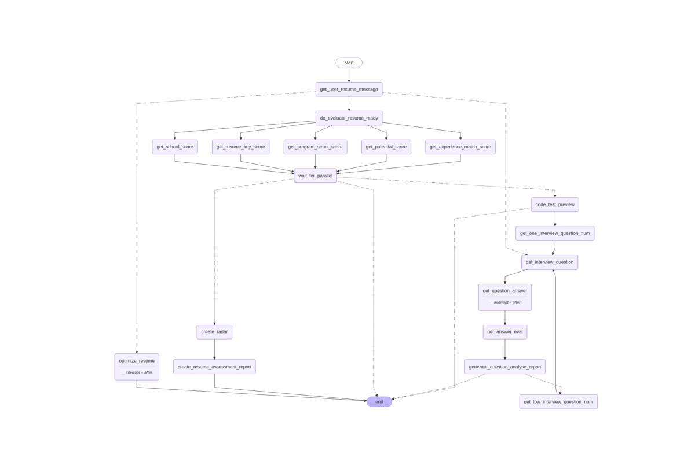
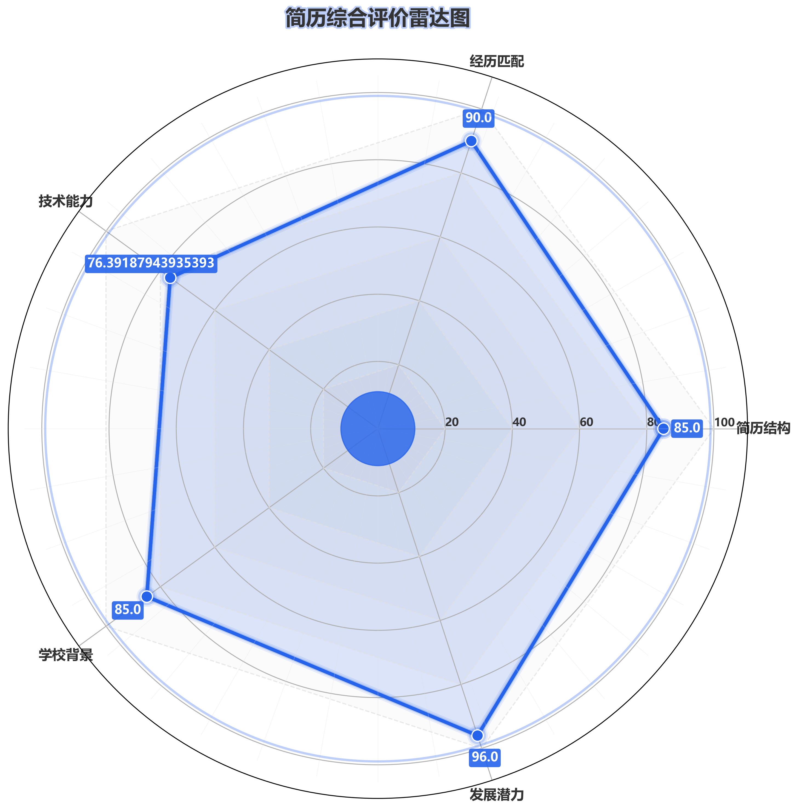
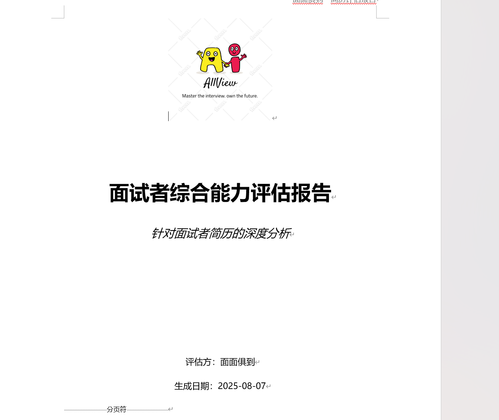
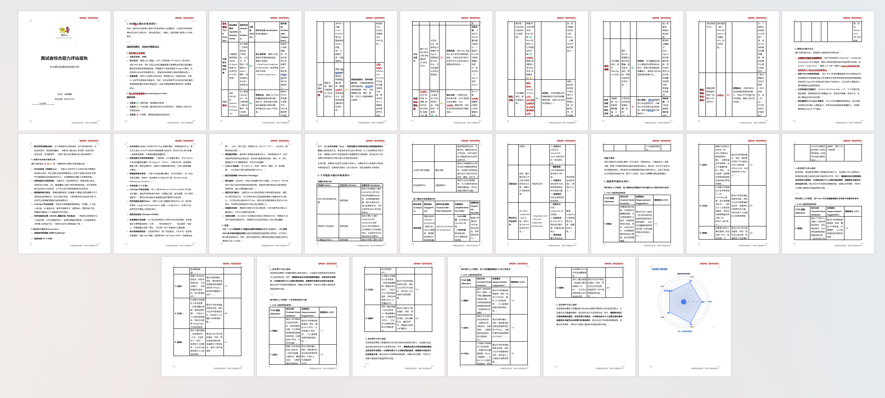

# Multimodal Interview Assessment Agent

## Project Introduction

This project is a comprehensive recruitment and interview assistance system developed based on large models and agents, leveraging the `langgraph` and `llamaindex` agent frameworks. It aims to enhance job search efficiency and interview performance by automating and intelligentizing the entire interview process, including resume evaluation, resume optimization, interview training, and simulated algorithm tests + interviews.
This project is also part of the China Software Cup iFLYTEK A3 competition.

## Workflow Display
- Developed with `langgraph`'s unique concurrent graphs, human-computer interaction, loops, etc.



## Key Features

- This project addresses all problems you might encounter during your job search, including resume evaluation and optimization, simulated interview questions, and algorithm tests. By building a knowledge base of interview questions from major companies using RAG technology, it enhances the usability of simulated interview questions, truly helping university students and unemployed individuals improve their interview success rate.

### 1. Resume Extraction
- This project uses `llamaindex`'s `PDFReader` to read user-uploaded resumes, Parse the resume content by splitting it by headings using regular expressions, then build a corresponding index and save it in the state
```python
headers = {
        "教育经历": "school",
        "项目经历": "program",
        "工作经历": "work",
        "实习经历": "work",
        "专业技能": "technology_stack",
        "技能栈": "technology_stack",
        "荣誉奖项": "awards",
        "个人优势": "technology_stack",
        "获奖情况": "awards",
        "志愿者服务经历":"school_work",
        "社团/组织经历": "school_work",
    }
```
**Note that the titles of relevant sections in your resume must correspond to the titles above; otherwise, the corresponding content may not be correctly structured.**

### 2. Resume Evaluation

#### 2.1 Evaluation Content
This system evaluates user-provided resumes across five dimensions and generates a corresponding five-dimensional radar chart and an evaluation report. The five dimensions include:
*   **Future Potential Score**
*   **Educational Background Score**
*   **Resume Technical Stack and Job Matching Score**
*   **Work/Internship Experience Matching Score**
*   **Resume Writing Structure Score**
#### 2.2 Evaluation Method
- This section employs an asynchronous parallel `langgraph` state graph design, significantly reducing evaluation time.
- Subgraph encapsulation: The educational background score node and work experience matching score node are encapsulated into a `react_agent`, equipped with self-invoking search tools. The agent can autonomously query school strengths and relevant internship experiences mentioned in the resume for accurate evaluation.
- In the technical stack matching node, I score from two aspects: 1. Overall semantic similarity score, and 2. KeyBERT keyword similarity score. Different weights are used to comprehensively evaluate the alignment between the resume and job requirements in terms of technical stack.

#### 2.3 Evaluation Results
- Five-dimensional Radar Chart


- Evaluation Suggestion Report


**The report is entirely AI-generated, contains extensive tabular data, is clearly structured, and is easy for users to read. The report primarily includes suggestions for users, such as recommendations for relevant open-source projects, advice on deepening resume projects, and more.**

### 3. Resume Optimization

Based on the resume evaluation results, the system provides targeted resume optimization suggestions and can generate an optimized PDF version of the resume. During the optimization process, the system may require the user to provide a personal photo to generate a more complete optimized resume.

### 4. Simulated Interview Training

#### 4.1 Question Types
The system intelligently assigns and generates interview questions based on the job information provided by the user, covering:
*   **Technical Fundamental Knowledge Questions**
*   **Project Experience Technical Questions**
*   **Business Questions**
*   **Soft Skills Questions**
Users can conduct interview training, and the system will record their answers.
#### 4.2 Question Generation Rules
* RAG Strategy
  * Built a knowledge base of interview questions from major companies (structured with metadata such as company name, interview position, and interview stage) stored in a `chroma.db` vector database.
  * Indexing: Uses query reformulation + metadata extraction for initial indexing, then employs a retrieval strategy with language similarity and re-ranking for recall.
* Prompt Strategy
  * Adopts a COT (Chain-of-Thought) prompt strategy to guide the large model to delve into resume content and interview positions, making the generated questions more targeted at the content mentioned in the user's resume.
#### 4.2 Evaluation Metrics
*   **Answer Quality**
*   **Body Language**
*   **Voice Tone and Emotion**

#### 4.3 Output Content
*   **Question Analysis Report**
    *   Meaning of the question and analysis of potential traps
    *   Related question extensions
    *   Standard示范答案 (Standard Sample Answer)
    *   User's answer
    *   Analysis of user's answer (strengths + weaknesses)

**This helps users understand and solve problems at a deeper level.**

### 4. Simulated Interview (Algorithm Test and Full Interview Process)

#### Algorithm Test
The system can intelligently filter and generate algorithm problems from the Codeforces platform based on job requirements. Users need to provide their Codeforces account, and the system will check their submission status for specified problems within a given time to determine if the test is passed.

#### Simulated Interview
After passing the initial resume screening and algorithm test, the system will proceed to the simulated interview stage. This stage includes:
*   **Resume Initial Screening**: Determines whether to pass the interview based on a comprehensive score derived from different weights across the five dimensions (if the academic score is unqualified, it will be directly rejected).
*   **Question Generation and Answer Recording**: The system poses interview questions and records the user's voice and video answers.
*   **Answer Evaluation**:
    *   Converts the user's voice answer to text.
    *   Evaluates the **content quality** of the user's answer.
    *   Analyzes the user's **body language** and **voice tone and emotion**.
    *   Provides a detailed question analysis, standard answers, and user answer evaluation report.
*   **Interview Advancement Judgment**: Based on the comprehensive score of the user's answers, determines whether to pass the current interview round (supports multiple interview rounds, such as first and second interviews, conforming to the multi-round structure of major companies).

## Technology Stack and Core Libraries

*   **Python**: Primary development language.
*   **LangGraph**: Used for building and managing complex agent workflows.
*   **Large Language Models (LLMs)**: Integrates various LLMs, including:
    *   Google Gemini (via `ChatOpenAI` interface)
    *   DeepSeek (via `ChatOpenAI` interface)
    *   Qwen (via `ChatOpenAI` interface)
*   **Codeforces API**: Used to retrieve algorithm problems and user submission records.
*   **Audio and Video Processing**: May involve `do_record_video.py` and `multimoding_dispose.py` for recording, processing, and analyzing audio and video during interviews.
*   **PDF Processing**: Used for resume reading and report generation.
*   **LangChain**: Used for LLM integration and prompt engineering.

## Project Structure

```
.
├── api_key.py                  # API Key Configuration
├── base.py                     # Base Data Structure Definition (Resume TypedDict) and LLM Client Initialization
├── code_test.py                # Codeforces Algorithm Test Related Logic
├── do_record_video.py          # Video Recording Functionality
├── generate_doc.py             # Document Generation (Resume Evaluation Report, Interview Question Analysis Report)
├── generate_interview_question.py # Interview Question Generation Logic
├── generate_question_answer.py # Interview Question Answer Generation and Evaluation Logic
├── interview.py                # Core Interview Process Logic (Question Assignment, Recording, Evaluation)
├── main.py                     # Project Entry Point, Demonstrates Running Different Functional Modules
├── multimoding_dispose.py      # Multimodal Data Processing (Audio to Text, Body Language/Emotion Analysis)
├── rag.py                      # May involve Retrieval Augmented Generation (RAG) related functionality
├── resume_agent.py             # LangGraph Agent Workflow Definition and Coordination
├── resume_analyse.py           # Resume Analysis and Evaluation Core Logic
├── stopwords-mast/             # Stopwords Library
│   └── stopwords-master/
│       ├── baidu_stopwords.txt
│       ├── cn_stopwords.txt
│       ├── hit_stopwords.txt
│       ├── README.md
│       └── scu_stopwords.txt
├── pdf_reports/                # Directory for Generated PDF Reports
├── resume_data/                # Directory for User Resume Data
├── video_picture/              # Directory for Videos and Pictures
├── 简历评估/                   # Directory for Resume Evaluation Related Files
├── 简历照片/                   # Directory for Resume Photos
├── 雷达图/                     # Directory for Radar Charts
├── 面试视频（用户）/           # Directory for User Interview Video Recordings
├── 面试知识库/                 # Directory for Interview Knowledge Base
├── 问题解析/                   # Directory for Question Analysis Results
├── 优化简历/                   # Directory for Optimized Resumes
└── 语音资料（用户）/           # Directory for User Interview Audio Data
```

## Installation and Running

1.  **Clone the Project**:
    ```bash
    git clone <project_repository_url>
    cd 面试系统
    ```
2.  **Create and Activate Virtual Environment** (Recommended):
    ```bash
    python -m venv venv
    source venv/bin/activate  # macOS/Linux
    # Or venv\Scripts\activate  # Windows
    ```
3.  **Install Dependencies** (Supplement if missing):
    ```bash
    pip install -r requirements.txt 
    ```
    
4.  **Configure API Keys**:
    Fill in your Google Gemini, DeepSeek, Qwen, and other large model API keys in the `api_key.py` file.
    ```python
    # api_key.py example
    google_api = "YOUR_GOOGLE_API_KEY"
    dp_api = "YOUR_DEEPSEEK_API_KEY"
    qwen_api = "YOUR_QWEN_API_KEY"
    ```
5.  **download embedding and sentence-transformer model （you can in huggingface）and  write path**
```python
encode_path = r"" #sentenc-transformer, it is shibing624text2vec-base-chinese.onnx
path = r"" #emmbeding模型
rerank_model_name = r""  # 示例模型
# 注意：对于中文，'BAAI/bge-reranker-base' 或 'BAAI/bge-reranker-large' 通常是更好的选择
# rerank_model_name = "BAAI/bge-reranker-base" # 如果处理中文内容，可以尝试这个
```
5.  **Create Necessary Directories**:
    Some directories will be automatically created when the project starts, but you can also manually check or create them:
    `pdf_reports`, `resume_data`, `video_picture`, `简历评估`, `简历照片`, `雷达图`, `面试视频（用户）`, `面试知识库`, `问题解析`, `优化简历`, `语音资料（用户）`.
6.  **Run Example**:
    Modify the `path` and `job` variables in `main.py` and uncomment the function you want to run (e.g., `asyncio.run(main1())`).
    ```bash
    python main.py
    ```

## Usage Instructions

*   **Resume Evaluation**: Run the `main1()` function in `main.py`.
*   **Resume Optimization**: Run the `main2()` function in `main.py`.
*   **Interview Training**: Run the `main3()` function in `main.py` and adjust the `interview_question_num` parameter as needed.
*   **Simulated Interview (Algorithm Test)**: Run the `main4()` function in `main.py` and provide your `code_id`.

## To Be Improved / Future Outlook

*   I have only collected about 300 interview questions, and due to the lack of interview data, the RAG part is relatively weak. Therefore, the project does not use RAG by default, but all the backend logic for RAG has been provided. My purpose in doing this part is to allow everyone to choose appropriate retrieval and construction strategies based on different scenarios to achieve a balance between time and quality, and also to improve my technical skills. If more interview data can be obtained in the future, integrating RAG will yield very good results.
*   No frontend interface has been added. My original intention was to improve my mastery of `agent` and `RAG`, so I only provided the interfaces. As for the backend framework and frontend, I have not developed them but hope that professionals can optimize them to achieve a more user-friendly interaction.
